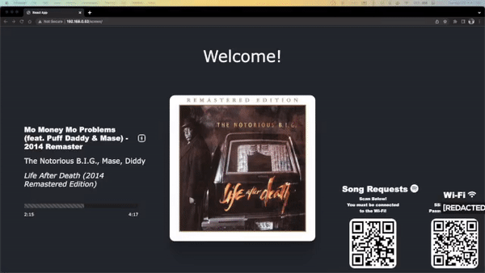
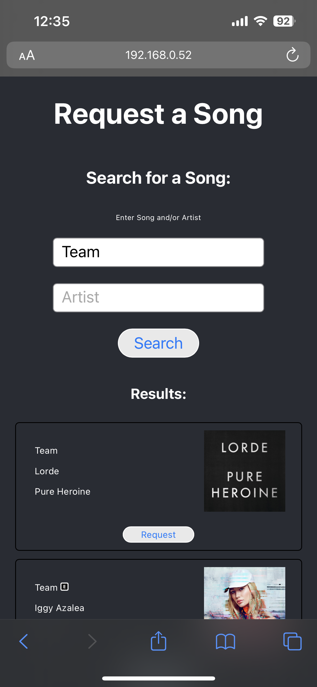

## Party Screen with song requests!

This is a simple party screen that allows you to request songs to be played at the party. It is a simple web app that uses the Spotify API to search for songs and add them to a playlist. It allows users to easily request songs to be played at the party, which are added to the owner's Spotify queue. 

## Features


<br><br>


#### Party Screen TV Webpage:
* Displays the current song playing:
    - Song name
    - Artist
    - Album
    - Album art
    - Explicit label, if applicable
    - Song length
    - Song progress with progress bar

* Customizable welcome message

* Song Requests QR Code

* WiFi QR Code and respective information

* A popup when someone requests a song

#### Party Request Mobile Webpage:
* Signs user into Spotify, that way all communication with the Spotify API is done on the user's behalf

> Note: The user must have a Spotify account in order to request a song. This is required to communicate with the Spotify API, and allows future rate limiting features (coming soon) to avoid queue spamming.

* Search for songs and/or artists and request the song they want

## Requirements
* A [Spotify Developer account](https://developer.spotify.com/dashboard/applications), used for the owner of the party
* A dedicated Linux server on your local network, running a distro that supports Systemd (Debian, Ubuntu, Arch, etc.)
> This will be used to host the web app and run the Spotify queue updater. It is recommended to use a dedicated server for this, as it will be running 24/7 and will be used to update the Spotify queue. It is also recommended to use a server that is always on, such as a Raspberry Pi or a dedicated server.<br>
> Using ethernet is recommended, as it will be running 24/7 and will be used to update the Spotify queue. It allows for the most stable connection to your home network as possible.
<br>
> These instructions will be using a Debian server.
* Another device running a [Home Assistant](https://www.home-assistant.io/) instance that supports addons, with the [Node-Red addon](https://github.com/hassio-addons/addon-node-red) installed. You must also have the Spotify Connect integration installed in Home Assistant, with **the same account you will be using for the party**. 
> This is used to communicate with the Spotify API and the server running the party screen.

## Setup
### Spotify Developer Account
1. Create a [Spotify Developer account](https://developer.spotify.com/dashboard/applications).
2. Create a new app, and name it whatever you want. 
> The App name you choose is what will be displayed when you sign into Spotify on the party request page.
3. Click on Edit Settings. Under **Redirect URI's**, add the IP address of your server, followed by `/request`. For example, if your server's IP address is `192.168.0.52`, you should enter `http://192.168.0.52/request`.
4. Click on **Show Client Secret** and copy the Client ID and Client Secret. You will need these later.

### Node-Red Setup Part 1: Updating Now Playing Status on the Linux Server
1. Open the Node-Red addon in Home Assistant.
2. Follow the instructions in the [Node-Red Spotify Connect](https://flows.nodered.org/node/node-red-contrib-spotify) to initialize the Spotify OAuth flow.
3. Create a new flow, and name it whatever you want.
4. Add a new `inject` node. Set `msg.payload = timestamp`, and set the `Repeat` interval to `every 1 seconds`. This will allow Node-Red to pick up the current song playing on Spotify and constantly update the party screen status.
5. Current State Node
    1. Connect the end of the `inject` node to the start of a new `current state` node. 
    2. Change the `entity_id` to `media_player.spotify_[your account name]`. 
    3. Set `if state` to `is` `playing`. Set `For` to `0 minutes`.
    4. Under **output properties**, set `msg.payload` to `true` and `msg.data` to `entity`.
    5. Optional, but you should add a Name for this node so that you rememeber what it does. Maybe something like `Get Spotify State`.
6. Spotify Node
    1. Connect the end of the `current state` node to the start of a new `spotify` node.
    2. Change credentials to `Spotify OAuth2`.
    3. Change `API` to `getMyCurrentPlaybackState`.
7. Parsing the Spotify API Response with a Function Node
    1. Connect the end of the `spotify` node to the start of a new `function` node.
    2. Copy and paste the following code into the function node:
    ```javascript
    const response = msg.payload;

    let artists = '';
    response.item.artists.forEach(artist => {
        artists += artist.name + ', ';
    })
    artists = artists.substring(0, artists.length - 2);

    const data = {
        name: encodeURIComponent(response.item.name),
        artist: encodeURIComponent(artists),
        explicit: encodeURIComponent(response.item.explicit),
        album: encodeURIComponent(response.item.album.images[0].url),
        album_name: encodeURIComponent(response.item.album.name),
        duration_ms: encodeURIComponent(response.item.duration_ms),
        progress_ms: encodeURIComponent(response.progress_ms) 
    }

    let url = '';
    const keys = Object.keys(data);
    const vals = Object.values(data);

    for (var i = 0; i < keys.length; i++) {
        url += `${keys[i]}=${vals[i]}`;
        if (i < keys.length - 1) {
            url += '&';
        }
    }

    url += '/';

    console.log(url);

    return { payload: url };
    ```
    3. Optional, but you should add a Name for this node so that you rememeber what it does. Maybe something like `Parse Spotify API Response`.
8. HTTP Request Node
    1. Connect the end of the `function` node to the start of a new `http request` node.
    2. Change `Method` to `GET`.
    3. Change `URL` to the following, replacing my ip address with your linux server's: `http://192.168.0.52:8080/update?{{{payload}}}`
    4. Optional, but you should add a Name for this node so that you rememeber what it does. Maybe something like `Update Party Screen`.

### Node-Red Setup Part 2: Checking for a new queue item on the Linux Server and updating your Spotify Queue
1. Create a new flow, and name it whatever you want.
2. Copy the `inject` node from the previous flow, and paste it into this flow.
3. Copy the `current state` node from the previous flow, and paste it into this flow. Connect the end of the `inject` node to the start of the `current state` node.
4. Add a new `http request` node. Change `Method` to `GET`. Change `URL` to the following, replacing my ip address with your linux server's: `http://192.168.0.52:8080/latestrequest`. Change `Return` to `a parsed JSON object`. Connect the end of the `current state` node to the start of the `http request` node.
5. Add a new `function` node. Copy and paste the following code into the function node:
```javascript
if (Object.keys(msg.payload).includes('message')) {
    return { payload: null }
}

msg.params = [msg.payload.songid]

return msg;
```
6. Add a new `spotify` node. Change credentials to `Spotify OAuth2`. Change `API` to `addToQueue`. Connect the end of the `function` node to the start of the `spotify` node.

Press the `Deploy` button to save the changes and make them active.

### Linux Server Setup Part 1 - api.js
1. SSH into your linux server. For the purpose of this tutorial, I've created an entry in my ~/.ssh/config file to make this easier, with the alias `linux`. In this phase of the setup, replace `linux` with however you usually SSH into your linux server.
2. Add 3 new directories in your home folder with the following command: `mkdir api && mkdir request && mkdir screen`. This will be where we store the code for the API and be used as a temporary location for getting your web application onto the Linux server.
3. Change into the new directory with the following command: `cd api`.
4. Copy the code from my [api.js](https://github.com/mv5903/party-screen/blob/main/api.js) file and paste it into a new file called `api.js` in the `api` directory, using your favorite command line editor like vim or nano.
5. Ensure you have node installed. If not, you should run the following command: `sudo apt install nodejs npm`.
6. Install the following dependencies from the api folder with this command: `npm install -g express cors pm2`
7. Test that the api runs first, by running the following command: `node api.js`. If you see the following output, then you're good to go:
```App is listening on port 8080!```
8. Use pm2 to run the api in the background with the following command: `pm2 start api.js`. You can check that it's running with the following command: `pm2 list`.

### Linux Server Setup Part 2 - apache2
1. Install apache2 with the following command: `sudo apt install apache2`. Follow all setup instruction given by the installer.
2. Change into the apache2 directory with the following command: `cd /var/www/html`.
3. Create three directories using the following command:
```sudo mkdir screen && sudo mkdir request && sudo mkdir static```
4. Test that apache2 is working by navigating to your linux server's ip address in your browser. You should see a default apache webpage.

### Local Building of the Project and Deploying it on your Linux Server
1. Clone this repository to your local machine. You should open this project with a code editor like VS Code.
2. Under `party-request/src/assets`, create a new file called `secrets.js`. Copy and paste the following code into the file, replacing the placeholders where necessary:
```javascript
export const SECRETS = {
    // RequestForm.js
    clientID: 'Your client id',
    clientSecret: 'You client secret',
    redirectURI: 'http://[AddressOfYourLinuxServer]/request',
    apiURI: 'http://[AddressOfYourLinuxServer]:8080/',
    scopes: 'user-read-playback-state user-read-private user-read-email',
}
```
3. Under `party-screen/src/assets`, create another new file called `secrets.js`. Copy and paste the following code into the file, replacing the placeholders where necessary:
```javascript
export const SECRETS = {
    // Wifi.js
    ssid: 'Your wifi name',
    password: 'Your wifi password',

    // Spotify.js
    apiAddress: 'http://[AddressOfYourLinuxServer]:8080',
}
```
4. Use a QR Code generator to generate a QR code for the following URL: `http://[AddressOfYourLinuxServer]/request`. Place this image in the `party-request/src/assets` directory, and name it `wifi.png`.
5. Use a QR Code generator to generate a QR code for your wifi network information. Place this image in the `party-screen/src/assets` directory, and name it `wifi.png`.
6. Change into the `party-request` directory with the following command: `cd party-request`.
7. Install the dependencies with the following command: `npm install`.
8. Build the project with the following command: `npm run build`.
9. Copy the screen project onto your Linux server with the command: `scp -r party-screen/build/. linux:~/screen/`. Remember to replace `linux` with your Linux server's alias.
10. Copy the request project onto your Linux server with the command: `scp -r party-request/build/. linux:~/request/`. Remember to replace `linux` with your Linux server's alias.


### Final Steps: Moving stuff around into your Web Server.
1. SSH into your Linux server.
2. Run these commands to copy the two web applications into the correct folders:
`sudo cp -r request/. /var/www/html/request && sudo cp -r screen/. /var/www/html/screen`
3. Run these commands to copy the static files into the root html folder so that the projects can access the required metadata:
`sudo cp -r /var/www/html/screen/static/. /var/www/html/static && sudo cp -r /var/www/html/request/static/. /var/www/html/static`.

Test it out! On a web browser connected to a display, navigate to `http://192.168.0.52/screen`, replacing the IP address with yours. You should be able to request songs from your phone by scanning the QR Code on the screen. Make sure your phone is on the same wifi network as your Linux server! You will be prompted to login to Spotify, and then you can request songs, where they will be added to the party owner's queue.

## Planned Features
- [ ] Add a way to limit the number of songs that can be requested by a single user within a certain time period.
- [ ] Add an option that allows the party owner to choose whether or not they want to allow users to request songs that have already been played.

For any inquiries, please feel free to reach out to me by any of the contact methods listed on my [website](https://www.mattvandenberg.com).