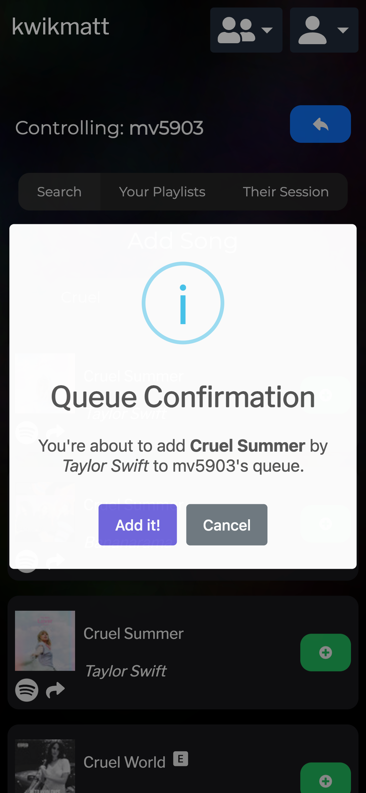
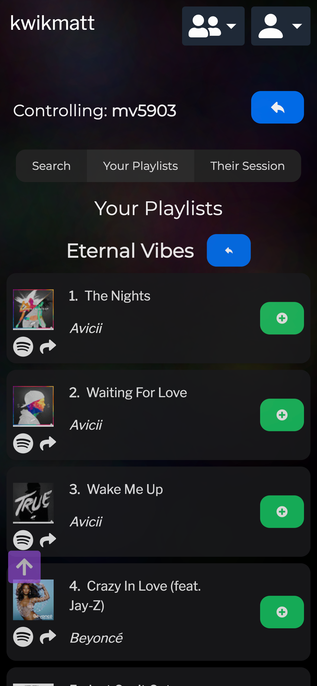

# Partyfy

### Why did I create this?

#### Backstory

One of my favorite activities when I am with my friends is to go on a long drive and talk, but most importantly we listen to music. With the release of Spotify's Group Session functionality, we thought that was a great solution so that my friends could easily add to my queue while I was driving and had my phone connected to Apple CarPlay. However, we quickly realized that this was not the best solution as there were several drawbacks using the included functionality:
 
1. The group session would randomly disband, and I would have to use my phone to invite everyone back to the session again (sometimes this was almost every hour).
2. The queue desyncs between phones sometimes, outright not showing the same queue on everyone's phone.
3. The content plays back on everyone's phone, so they have to turn their volume all the way down to not hear the music twice. This is especially annoying to them because they cannot freely use other apps that have sound while the group session is active.

#### So what does Partyfy solve?

I created Partyfy to solve all of these issues to the best of my ability. It is an application with a friends system, which allows everyone to be linked up together. When the person playing the music (like me, the driver) turns on what I call **unattended queues**, my friends are freely able to search for songs and add them to my playback queue, without me needed to take any action whatsover. Here are some more details:
  

    <strong>The Friend Screen</strong>  
    
     
    Here you can see a list of all of your friends that you have added from the friend icon on the top right of this screen. I have the option to disabled unattended queues, which will immediately remove the functionality for any of my friends to add to my queue. <i><strong>By default, this option is Disabled and yellow in color.</strong></i> Any of my friends who also have that functionality enabled will appear in green, while those that do not will appear in grey. I can reload the status with the blue refresh button on the right.

 

    <strong>Searching for a Song</strong>  
    
        
     
    Once I click on one of my friends, I am presented with this screen. I can search for songs and add them to the queue. The search results are populated directly from the Spotify API using the logged in user's access token.

 

    <strong>Adding from my Playlists</strong>  
    
    
     
    If I can't quite remember the name of song I want added, I can click on the "Your Playlists" tab which will bring me to this screen. Here I can see all of my playlists and add songs from them to the queue by clicking on View next to one of them.

 

    <strong>Viewing Their Queue</strong>  
    
     
    Once I am happy with my additions, I can click on "Their Queue" to view the host's Spotify queue. This is directly mirrored from the Spotify API, so it will always be up to date give or take a few seconds. You may notice that there are songs that are not on their queue but are still populating this screen. See the next section for more details on this.

### Limitations
Sadly some of the most requested features are currently impossible due to the current version of Spotify's API. They currently do not provide endpoints for the following actions:
1. Deleting an item from the queue
2. Rearranging items in the queue
3. Keeping the queue just the queue, not a combination of the queue (which is always at the top, luckily) and items that will play next based on the playlist content is being streamed from.

These items will be implemented as soon as I hear back from Spotify and have access to this. Thank you for understanding.

### Stack
For those who are curious, here is a general overview of the stack used to create this application:
- Frontend: React with Typescript
- Backend: Node.js with Express using the Next.js framework
- Database: Vercel's PostrgreSQL database with Prisma ORM
- Authentication: Auth0
- Hosting: Vercel

# Important Note
This application is not guranteed to work publicly, as my app is still pending extended quota mode from Spotify's review team. This means that in order for the app to work for you, I must add you to my list of approved users. If you would like to be added or be shown a live demo for the time being, please send me an email at **mv5903@gmail.com** and we can discuss futher.

